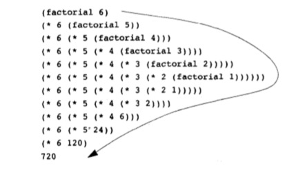
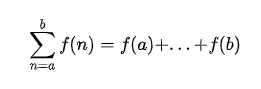

> 函数与过程之间的矛盾，不过是描述一件事的特征，与描述如何去做这件事情之间的差异的反映
>
> 在数学里，人们通常关心的是说明性的描述（是什么）
>
> 计算机科学里，人们则通常关心行动性的描述（怎么做）


### 线性递归和迭代

以**阶乘函数**为例

1. **线性递归过程**

```scheme
(define (factorial n)
	(if (= n 1)
    1
    (* n (factorial (- n 1)))))
```

2. **线性迭代过程**

我们换个观点计算阶乘：先乘起1和2，再将结果乘以3，4..n

我们需要维持变动的乘积 product 和计数器 counter

product ← counter * product

counter ← counter + 1

```scheme
(define (factorial n)
	(fact-iter 1 1 n))

(define (fact-iter product count max-count)
  (if (> count max-count)
      product
      (fact-iter (* product count) (+ count 1) max-count)))
```

#### 比较一下两个过程

- 都是同一个定义域里的数学函数：n的正比步骤去计算 n!

- 从计算过程来看

  第一种是展开然后收缩的过程，推迟执行形成的运算链条，收缩阶段是实际执行的过程 → **递归计算过程** 计算轨迹需要保存的



​	第二种的计算轨迹所有需要的东西只有 product, counter 和 max-count 也就是用固定数量的状态来描述计算过程

- 另一个角度

  如果需要停止上面两种计算过程，然后再重新唤醒计算，迭代计算过程只需要提供三个变量的值

  而递归过程还存在另外的隐含信息，并没有保存在变量里，在运算形成的链条中漫游，链条越长，需要保存的东西越多

------

### 高阶函数作为抽象

```scheme
(define (cube x) (* x x x))

(* 3 3 3)
(* x x x)
(* y y y)
```

如果不提出 cube 这个函数，我们只能在语言恰好提供了的那些特定基本操作的层面上工作，不能基于更高级的操作去工作。我们写出的程序也能计算立方，但是所用的语言却不能表述立方这一概念。

但是过程限制为只能以数字作为参数，那会严重影响抽象的能力。 => 将过程作为抽象

---

### 过程抽象

```scheme
(define (sum a b)
  (if (> a b)
    0
    (+ a (sum (+ a 1) b))))
    
(define (sum-cube a b)
  (if (> a b)
    0
    (+ (cube a) (sum-cube (+ a 1) b))))

(define (pi-sum a b)
  (if (> a b)
    0
    (+ (/ 1 (* a (+ a 2))) (pi-sum (+ a 4) b))))
```

这是求和，求立方和,以及


 
 这样的序列求和的例子


其实很容易发现这两个过程是共享着一种公共的基础模式，只是所用过程的名字上不太一样

我们再来抽象一下，`term` 是对 `a` 的操作，`next` 代表了一种改变参数的步进，计算了下一步的a的值。

```scheme
(define (sum term a next b)
  (if (> a b)
    0
    (+ (term a) (sum term (next a) next b))))
```

我们再来用这样的过程抽象去做上面的简单求和

```scheme
(define (inc n) (+ n 1))

(define (sum-cube a b)
  (sum cube a inc b))

(sum-cube 2 3)

(define (indentity a) a)

(define (sum-intergers a b)
  (sum indentity a inc b))

(sum-intergers 1 10)

(define (pi-sum a b)
  (define (pi-term x)
    (/ 1.0 (* x (+ x 2))))
  (define (pi-next x) (+ x 4))
  (sum pi-term a pi-next b))
```

我们再想一下，其实数学家早就认识到了序列求和中的抽象模式：“求和计法”



以前觉得抽象出来的函数主要目的只是复用而已，书上讲的数学定理 → 抽象 真的厉害